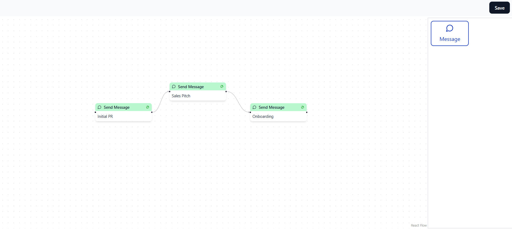
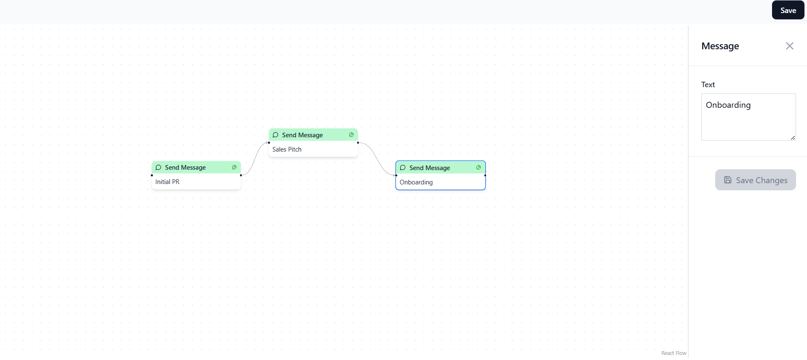
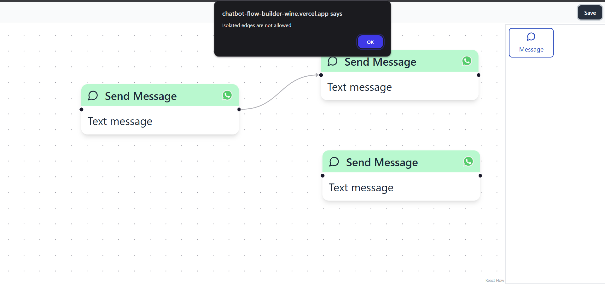

# Chatbot Flow Builder

Link: https://chatbot-flow-builder-wine.vercel.app/

## Screens

Todo:
1. Replace alerts with toasts
2. After clicking on a node, when I click outside of it - settings panel should close
3. Delete a node by pressing `Delete`
4. Delete an edge by pressing `Delete`
5. Data type need to be more dynamic to allow future addition of different nodes

Bugs:
1. Drop position is not correct
2. Consecutive selection of different nodes does not change the settings panel content sometimes
